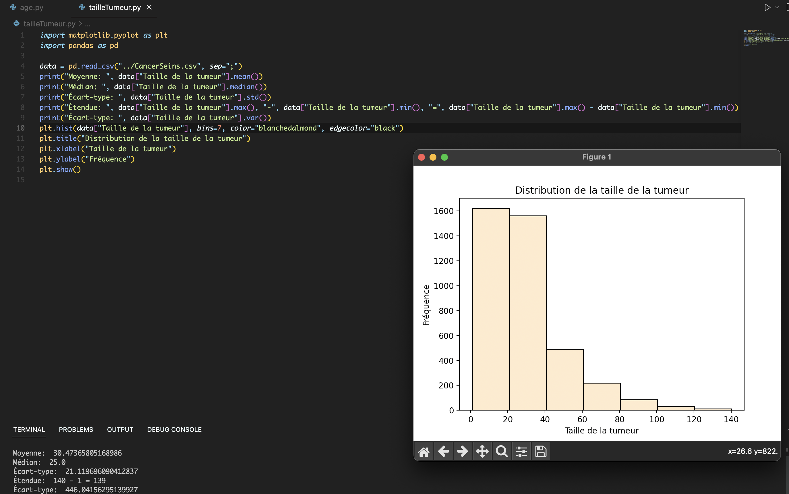
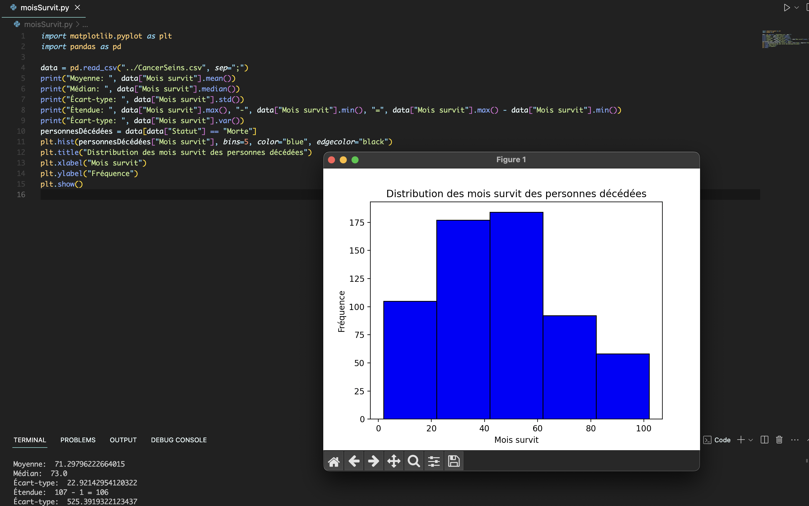
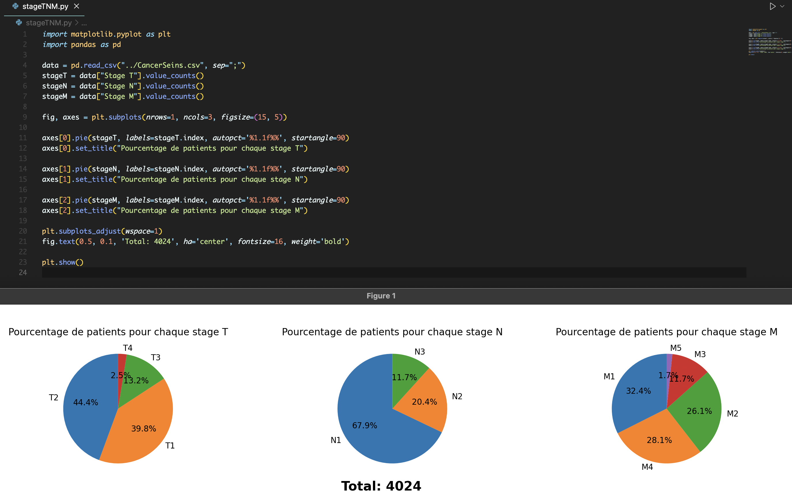

# Breast Cancer Data Visualization Project with Python, R and Scala ☀️

## 📚 Table of Contents
1. [Introduction](#overview)
2. [Project Objective](#project-objective)
3. [Project Structure](#project-structure)
4. [Technologies Used](#technologies-used)
5. [Installation](#installation)
---

## 🔎 Overview 


#### ✨ Project Context
Breast cancer is the most common cancer among women, making up about 25% of all female cancers. It’s also the second most fatal cancer for women, after lung cancer. Breast cancer starts when breast cells mutate, dividing uncontrollably to form a tumor, which can spread if untreated.

Early diagnosis through mammography, ultrasound, or MRI, along with treatments like surgery, chemo, and radiation, can save lives. Regular screenings are vital for early detection and better outcomes.

#### 📊 Dataset
This project utilizes a breast cancer dataset, which includes various features, as: Age, Statut en œstrogène, Statut de la progestérone....


## 🎯 Project Goal

The primary goal of this project is to conduct an in-depth analysis of the breast cancer dataset using Python, R, and Scala, focusing on understanding the disease
This multi-language approach allows for camparaison between technologies when it comes to data visualisation


## 🗂️ Project Structure

```plaintext
.
├── data/                   # Dataset: CancerSeins.csv
├── screenshots/            # Screenshots from the project
├── plots/                  # Visualization folder
├── src/                    
│   ├── python/             # Python scripts 
│   ├── R/                  # R scripts
│   └── scala/              # Scala scripts
├── README.md               # Project documentation
```
---

## ⚙️ Techologies Used

- **Python**: Matplotlib, Pandas
- **R**: ggplot2
- **Scala**: Evilplot

  
<div style="display: inline;">
  
  
  
  
  
  
  
</div>

  


## 📥 Installation
  **Clone the Repository**
   ```bash
    git clone https://github.com/YoussefChahib/BreastCancerDataVis_Scala_Python_R.git
    cd BreastCancerDataVis_Scala_Python_R
----
```

<div align="center">
  
</div>
<div align="center">
  
</div>
<div align="center">
  
</div>
